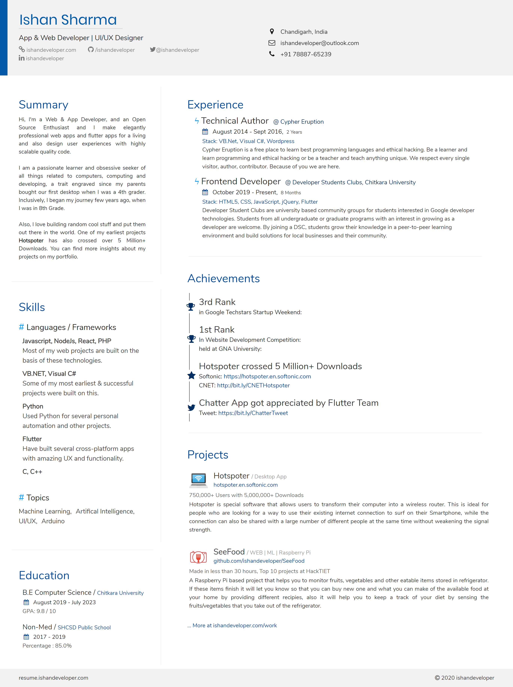

# Resume
This is a fully responsive web-based professional looking resume that I created. You can use this template to create your own resumes!

### Screenshot

#### View Live Demo At
<pre>
    <b><a href="http://resume.ishandeveloper.com">resume.ishandeveloper.com</a></b>
</pre>

### Features
* Easy to further customize or extend
* Full support for unicode character
* FontAwesome 4.7 support
* Easily Change/Add Your Experience, Achivements etc. Data In JSON

### Quick Start
1. Fork this repository
1. Change your information directly in <code>data.js</code> file.
1. Commit changes and deploy to Github Pages.

### Contributions

If you're interested in contributing to this project, please refer to <a href="CONTRIBUTING.md">CONTRIBUTING.md</a> guidelines.

### License
The MIT License (MIT)

Copyrighted fonts are not subjected to this License.

##### Made with ♥ by <a href="https://github.com/ishandeveloper">ishandeveloper</a>

